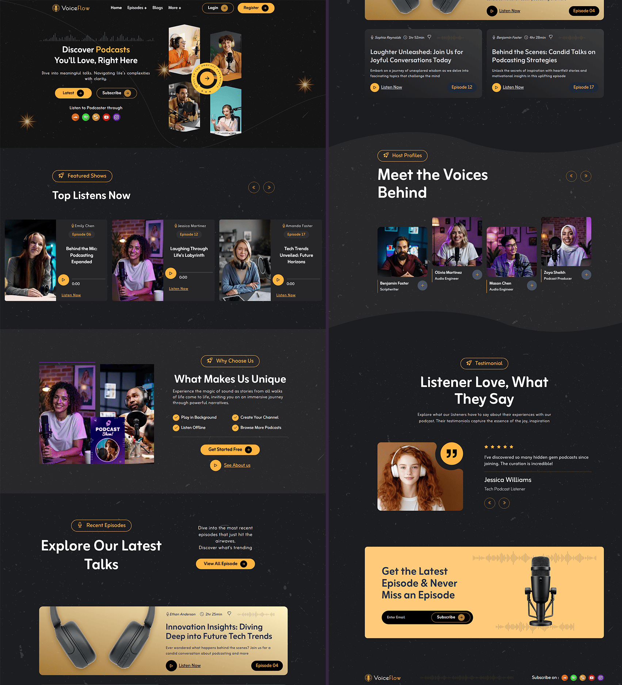

<h1 align="center">🎙️ VoiceFlow - Podcast Website Template </h1>

## Project Info

**VoiceFlow** is a **frontend-only** template that replicates the UI and interactions of a modern podcast host website (inspired by the Wavecast example). Built with **Next.js** and **TailwindCSS**, the project focuses on design, responsive layout, audio UI, and client-side interactions - **no backend, CMS, or production data layer included**.
Use it as a launchpad or UI prototype; integrate your own API, headless CMS, or server later.

<br>

<div align="center">

⁃ ᴄᴏɴᴛᴇɴᴛꜱ ⁃  
[Features](#features)
| [Visual Tour](#visual-tour)
| [Technologies](#technologies--libraries)
| [Quick Start](#quick-start)
| [Quick Start](#project-notes)


<div>
    
    
    
    
  </div>

</div>


---


<p align="center">
  
</p>

---

## Features

* Stunning podcast UI. Inspired by production grade sites, this design delivers a beautiful homepage, intuitive episode listings, and captivating detail pages.
* Episode carousel / highlights (Swiper).
* Category / tag filters and search-ready layout.
* Host profile / about pages and social links.
* Responsive design (mobile → desktop).
* Lightweight UI animations and counters (react-countup, GSAP-like interactions where used).
* Toast notifications for small UI events (react-hot-toast).
* Clean, reusable component structure suitable for extension.


<br/>

---

## Visual Tour


---

## Technologies & Libraries

**Framework / Tooling**

* Next.js 16.1.6
* React 19.2.3
* Tailwind CSS 4 + `@tailwindcss/postcss`

**UI / Helpers**

* Swiper (carousel)
* react-countup (counters)
* react-hot-toast (toasts)
* react-icons / @iconify/react / bootstrap-icons / remixicon (icons)
* clsx, tailwind-merge (class utilities)
* FontAwesome brands (social icons)

**Dev tools**

* TypeScript
* Biome (lint & format)


<br/>

---

## Quick Start

### Prerequisites

Ensure you have the following installed:  
- [Git](https://git-scm.com/)
- [Node.js](https://nodejs.org/en) (recommended LTS)
- [npm](https://www.npmjs.com/) (Node Package Manager)

### Clone & Install

```bash
git clone https://github.com/zyferlink/podcast-website-nextjs-app.git
cd podcast-website-nextjs-app
npm install
```

### Development

Start local dev server:

```bash
npm run dev
```

Open: `http://localhost:3000`

### Build / Production

```bash
npm run build
npm run start
```

### Lint & Format

```bash
npm run lint
npm run format
```

---

<br/>

### Project Branches

> <samp> **PRODUCTION BRANCH :**  </samp>  
> Stable code for deployment  
> ➲ [main][branch-main]


> <samp> **DEVELOPMENT BRANCH :**  </samp>   
> Active codebase for ongoing development efforts  (New features, bug fixes, and improvements..)  
> ➲ [dev][branch-development]

[branch-main]:  https://github.com/zyferlink/podcast-website-nextjs-app/tree/main

[branch-development]:  https://github.com/zyferlink/podcast-website-nextjs-app/tree/dev

<br/>

---

## Project Notes

* **Frontend-only template:** No backend API or CMS included. To serve real episodes, wire a headless CMS, RSS parser, or custom API to the page components and data fetching methods.


---
